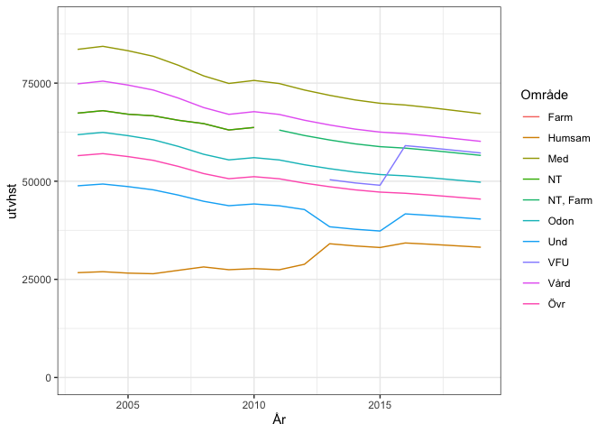

Ekonomiska trender och beslut
================

# Förändring av prislappar och löner över tid

Inledningsvis hämtas data från utbildningsdepartementet om prislapparnas
utveckling från år 2000 fram till idag för olika utbildningsområden. I
dessa data saknas prislappar för konstnärliga utbildningar av olika slag
och idrott inte tagits med. Detta beror på att de ligger så mycket högre
än övriga att jämförelse mellan de för oss aktuella blir svårare.

Med hjälp av diagrammet kan konstateras att VFU uppstod som en egen
prislapp i samband med att lärarutbildningen 2011 sjösattes och att den
höjdes relativt kraftigt mellan 2015 och 2016. Det går också att
konstatera att prislappen för Humsam höjdes mer än andra ungefär
samtidigt som VFU-prislappen infördes. Det går också att utläsa att
prislappen för Undervisning (kärnkurser i lärarutbildningen) sjönk i
samband med ökningen av prislappen för Humsam för att några år senare
höjas till ungefär motsvarande nivå som innan sänkningen runt 2016.

Under samma period har dock lönerna ökat också, vilket visas i nästa
diagram. Där har data för en genomsnittlig statstjänsteman används.

<!-- -->

Lönerna har också ökat under samma period men det blir först intressant
att jämföra löneutvecklingen med utvecklingen av prislapparna. Detta
görs i nästa diagram

<!-- -->

När hänsyn tas till löneutvecklingen minskar den reella tilldelningen
till alla utbildningsområden utom för VFU och Humsam som har haft en
positiv utveckling under perioden. Det finns på detta sätt ett inbyggt
krav på effektivisering av undervisningsversksamheten på högskolorna

## Orättvis tilldelning?

Under våren 2021 initierade institutionsledningen en diskussion på alla
avdelningar om hur stora skillnader som är rimliga mellan prislappar för
de olika utbildningsområdena inom institutionen efter det att kostnader
för materiel har tagits centralt. Detta utan att samtidigt reda ut
frågan om varför utbildningsdepartementet anser att det ska vara olika
prislappar för olika utbildningsområden. De i sammanhanget mycket höga
ersättningarna till konstnärliga området beror i stor utsträckning på
behovet av undervisning i små grupper och för enskilda individer samt
behovet av utrustning och ändamålsenliga lokaler.

De olika förutsättningarna som råder för olika utbildningsområdena
speglas i relativt stor mån av tilldelningen från
utbildningsdepartementet. Dock är det helt omöjligt att hantera olika
avdelningar inom en institution med att endast reglera prislappen utan
att ta hänsyn till ett antal andra faktorer. De mest avgörande är:

-   Antal studenter i kurserna

-   Kursledningsinsatsen är inte proportionell mot antal studenter. Det
    finns en del som är lika för alla kurser och en del som beror av
    antalet studenter

-   Andelen laborationer som är nödvändig i undervisningen och därmed
    maximal gruppstorlek

-   Andelen nödvändiga seminarier i undervisningen och för denna maximal
    gruppstorlek

Det är relativt lätt att konstatera att antalet studenter i kurserna är
den enskilt mest avgörande faktorn för hur mycket pengar en kurs
tilldelas. Därefter har delningstalen för hur stora grupper som är
möjliga att ha för säkra laborationer och meningsfulla seminarier stor
betydelse. Om underhåll, reparationer och arbetet med nyanskaffning av
utrustning och materiel läggs på undervisande lärare utgör också detta
en relativt stor kostnad som minskar antalet undervisade timmar.
Alltsedan teknikerfunktionen i form av Bo Malmensten försvann har denna
funktion i stort sett inte funnits utan istället lagts på undervisande
lärare med olika halvdana lösningar
